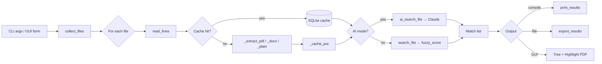

# Architecture

`fuzzer` is a single Python script (`fuzzer` at the repo root, no `.py`
extension so it works as a binary on `$PATH`). It bundles a CLI, a Tk GUI, an
optional Claude integration, and a C extension for Arabic text normalization.

## File layout

```
bin/
├── fuzzer                       ← the script (CLI + GUI in one file)
├── test_fuzzer.py               ← pytest suite
├── _ar_norm.cpython-*.so        ← built C extension (platform-specific)
├── .sourcery.yaml               ← linter config
├── Makefile                     ← test, build-native, docs targets
├── native/
│   ├── ar_normalize.c           ← C source for _ar_norm
│   └── setup.py                 ← extension build script
└── doc/                         ← this directory
```

## Module sections in `fuzzer`

The script is internally divided by `# ── section ───` banners. Each section
is a small piece you can read top-to-bottom without juggling files.

| Section | Lines | Purpose |
| ------- | ----- | ------- |
| Colour | ~30–50 | ANSI helpers (`_c`, `_r`, `_err`) |
| Types | ~52–60 | `Match` NamedTuple |
| Text extraction | ~62–146 | `_extract_pdf`, `_extract_docx`, `_extract_plain`, `_EXT_MAP` |
| Extraction cache | ~148–218 | SQLite-backed cache keyed by `(path, mtime)` |
| Arabic normalization | ~220–249 | `_normalize_arabic` — C ext → pyarabic → regex fallback |
| Fuzzy matching | ~266–330 | `_levenshtein`, `_builtin_ratio`, `fuzzy_score` (rapidfuzz/thefuzz) |
| Core search | ~330–365 | `search_file` — the inner loop |
| AI search | ~365–460 | `ai_search_file` — Claude integration |
| Output | ~460–545 | `print_results` + `_print_*` helpers |
| Export | ~545–710 | `export_results` + `_export_csv/json/xlsx/txt` |
| File collection | ~710–735 | `collect_files` (recursion + glob) |
| GUI | ~735–1630 | `run_gui` — entire Tk app, nested functions for state encapsulation |
| CLI | ~1630–1740 | `main` — argparse + dispatch |

## Search flow



## GUI internals

The GUI runs the search on a background thread and posts updates through a
`queue.Queue`. The main thread polls the queue every 100 ms via
`root.after(100, poll_queue)`. This keeps the UI responsive during long
searches and avoids the GIL contention that would arise from direct widget
updates from the worker thread (Tk widgets are not thread-safe).

### PDF highlighting (macOS)

When a PDF result row is opened:

1. `_build_highlighted_pdf` runs once per PDF during result population —
   it loads the PDF via PyMuPDF, groups matches by page, and tries three
   bbox-matching strategies in order:
   - Token-overlap: ≥60% normalized token coverage between match line and a dict line
   - Per-token fuzzy: any dict-line token at ≥70% similarity to the normalized query
   - Whole-line fuzzy: `SequenceMatcher` against the normalized full line, threshold 0.55
2. The highlighted copy is saved to `~/.fuzzer_tmp/fuzzer_<pid>_<id>.pdf`
3. Double-click invokes Preview via AppleScript:
   - `open POSIX file …`
   - resizes window via System Events UI scripting
   - jumps to the matched page using the `⌘⌥G` ("Go to Page…") shortcut

Tmp files older than 24 h are cleaned on every GUI launch.

## Sequence diagram

The full GUI/worker/Claude/cache interaction is in
[sequence-diagram.md](sequence-diagram.md) (rendered to
[sequence-diagram.png](sequence-diagram.png)).

## Caching

Two caches exist:

| Cache | Where | Keyed by | Purpose |
| ----- | ----- | -------- | ------- |
| Extraction | `~/.fuzzer_cache.sqlite` | `path` + `mtime` | Skip re-parsing unchanged PDFs/DOCX |
| Highlighted PDFs | `~/.fuzzer_tmp/fuzzer_*.pdf` | Per-search, by `pid + id(doc)` | Pre-built copies for instant Preview-open |

## Optional dependencies

`fuzzer` degrades gracefully if optional libraries are missing. Each is tried
at the point of use and a clear error is emitted if absent.

| Library | What it enables | Fallback |
| ------- | --------------- | -------- |
| `_ar_norm` (this repo) | Fast Arabic normalization | `pyarabic` → pure-Python regex |
| `pymupdf` (`fitz`) | PDF extraction + highlighting | `pdfplumber` (no highlighting) |
| `python-docx` | DOCX extraction | error message |
| `rapidfuzz` | Fast fuzzy scoring | `thefuzz` → built-in Levenshtein |
| `anthropic` | AI mode (`-a`) | error message |
| `openpyxl` | `.xlsx` export | error message |
| `tkinterdnd2` | Drag-and-drop into the GUI files entry | drag-drop disabled |
| `arabic_reshaper` + `python-bidi` | Arabic rendering on non-macOS | text appears unshaped on Linux/Windows |
