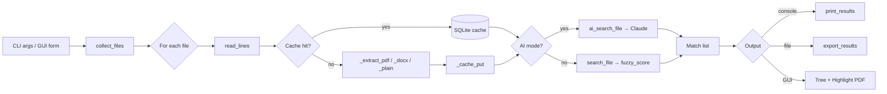
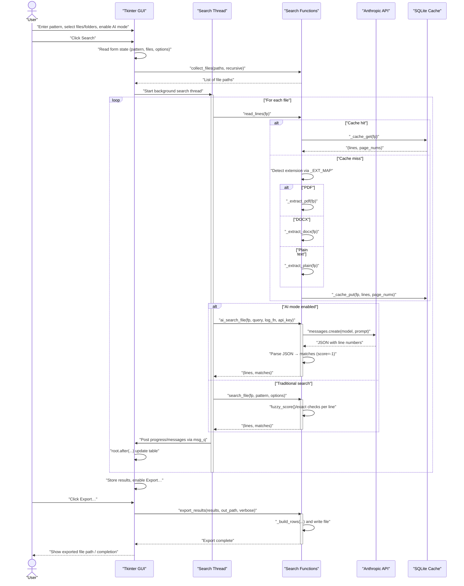

# Internals

Architecture, C extension reference, and the GUI/AI sequence diagram for the fuzzer.

---

## Architecture


`fuzzer` is a single Python script (`fuzzer` at the repo root, no `.py`
extension so it works as a binary on `$PATH`). It bundles a CLI, a Tk GUI, an
optional Claude integration, and a C extension for Arabic text normalization.

## File layout

```
bin/
├── fuzzer                       ← the script (CLI + GUI in one file)
├── test_fuzzer.py               ← pytest suite
├── _ar_norm.cpython-*.so        ← built C extension (platform-specific)
├── .sourcery.yaml               ← linter config
├── Makefile                     ← test, build-native, docs targets
├── native/
│   ├── ar_normalize.c           ← C source for _ar_norm
│   └── setup.py                 ← extension build script
└── doc/                         ← this directory
```

## Module sections in `fuzzer`

The script is internally divided by `# ── section ───` banners. Each section
is a small piece you can read top-to-bottom without juggling files.

| Section | Lines | Purpose |
| ------- | ----- | ------- |
| Color | ~30–50 | ANSI helpers (`_c`, `_r`, `_err`) |
| Types | ~52–60 | `Match` NamedTuple |
| Text extraction | ~62–146 | `_extract_pdf`, `_extract_docx`, `_extract_plain`, `_EXT_MAP` |
| Extraction cache | ~148–218 | SQLite-backed cache keyed by `(path, mtime)` |
| Arabic normalization | ~220–249 | `_normalize_arabic` — C ext → pyarabic → regex fallback |
| Fuzzy matching | ~266–330 | `_levenshtein`, `_builtin_ratio`, `fuzzy_score` (rapidfuzz/thefuzz) |
| Core search | ~330–365 | `search_file` — the inner loop |
| AI search | ~365–460 | `ai_search_file` — Claude integration |
| Output | ~460–545 | `print_results` + `_print_*` helpers |
| Export | ~545–710 | `export_results` + `_export_csv/json/xlsx/txt` |
| File collection | ~710–735 | `collect_files` (recursion + glob) |
| GUI | ~735–1630 | `run_gui` — entire Tk app, nested functions for state encapsulation |
| CLI | ~1630–1740 | `main` — argparse + dispatch |

## Search flow



## GUI internals

The GUI runs the search on a background thread and posts updates through a
`queue.Queue`. The main thread polls the queue every 100 ms via
`root.after(100, poll_queue)`. This keeps the UI responsive during long
searches and avoids the GIL contention that would arise from direct widget
updates from the worker thread (Tk widgets are not thread-safe).

### Streaming results

The worker emits a `("match", fp, lines, matches)` message for **each file**
as soon as it finishes, rather than accumulating all results and sending a
single `("done", results)` at the end. This means:

- Matches appear in the tree as soon as each file is scanned — the GUI never
  looks frozen while a large file is being processed last.
- Results from completed files survive a crash on a later file.
- PDF highlight copies are built file-by-file (inside `_append_file_results`)
  so they are ready to open before the full search finishes.

A bare `("done",)` message (no payload) is sent once all files are exhausted
or after a Stop, using `state["results"]` (populated incrementally by
`"match"` messages) for the final summary.

### PDF extraction robustness

`_extract_pdf_pymupdf` wraps each page's `page.get_text()` call in a
try/except. If `sort=True` raises (e.g., on a malformed Arabic page with
complex glyph ordering), it retries with `sort=False`. If that also fails the
page is silently skipped. A single bad page therefore does not abort extraction
of the rest of the document.

### PDF highlighting (macOS)

When a PDF result row is opened:

1. `_build_highlighted_pdf` runs once per PDF during result population —
   it loads the PDF via PyMuPDF, groups matches by page, and tries three
   bbox-matching strategies in order:
   - Token-overlap: ≥60% normalized token coverage between match line and a dict line
   - Per-token fuzzy: any dict-line token at ≥70% similarity to the normalized query
   - Whole-line fuzzy: `SequenceMatcher` against the normalized full line, threshold 0.55
2. The highlighted copy is saved to `~/.fuzzer_tmp/fuzzer_<pid>_<id>.pdf`
3. Double-click invokes Preview via AppleScript:
   - `open POSIX file …`
   - resizes window via System Events UI scripting
   - jumps to the matched page using the `⌘⌥G` ("Go to Page…") shortcut

Tmp files older than 24 h are cleaned on every GUI launch.

## Sequence diagram

The full GUI/worker/Claude/cache interaction is in
[sequence-diagram.md](sequence-diagram.md) (rendered to
[sequence-diagram.png](sequence-diagram.png)).

## Lazy file context in the chat panel

The chat panel does **not** preload file content into Claude's context.
Instead, when the user selects files/folders, `_build_chat_context` produces
a small **manifest** (path, line count, page count, one-line preview per
file) and ships that as the leading user message. Claude then uses tools to
fetch what it needs:

| Tool | Purpose |
| ---- | ------- |
| `search_in_context` | Fuzzy-search across all loaded files (reuses `search_file`). First call when answering most questions. |
| `read_file_chunk` | Read a specific line range from one file by path. |
| `list_results` | List files the last (non-AI) search hit. |
| `write_file` / `append_to_file` | Write or append output to disk. |
| `create_directory` / `delete_path` / `copy_file` / `move_file` | File ops. |
| `run_command` | Run a shell command (with optional UAC elevation). |

The motivation is rate-limit pressure: on tier-1 / free accounts the input
budget can be as low as 10 K tokens per minute. Preloading 50 K tokens of
file context fired a 429 on every turn. Manifests are typically a few
hundred to a few thousand tokens, so the model has headroom for tools.

## Token budgets and warnings

AI mode and the chat panel route everything through Claude Sonnet 4.6 (200 K-
token context window). Per-call caps are kept as tunable constants so the
budget is visible in one place rather than scattered as magic numbers.

| Constant | Where | Default | Purpose |
| -------- | ----- | ------- | ------- |
| `_AI_DOC_CHAR_CAP` | module-level, above `ai_search_file` | 120 000 chars | Hard truncate for the document sent to Claude in AI search |
| `_AI_DOC_CHAR_WARN` | same | 80 000 chars | Threshold for the "large document" GUI note |
| `_AI_MAX_TOKENS` | same | 8 192 | `max_tokens` on the AI-search response |
| `_CHAT_CONTEXT_BUDGET` | inside `run_gui` | 20 000 chars | Total manifest budget (paths + previews, not content) |
| `_CHAT_CONTEXT_WARN` | same | 15 000 chars | Threshold for the "large manifest" chat note |
| `_CHAT_MAX_HISTORY` | same | 40 turns | User/assistant turns kept after the leading context pair |
| `_CHAT_TOOL_ROUNDS` | same | 8 | Max tool-use rounds per chat turn |
| `_CHAT_MAX_TOKENS` | same | 16 384 | `max_tokens` on each chat-response round |
| `_CHAT_THINKING_BUDGET` | same | 10 000 | `budget_tokens` for extended-thinking blocks |
| `_CHAT_TOOL_RESULT_CAP` | same | 40 000 chars | Per-tool-call cap on output fed back to Claude |
| `_CHAT_SEARCH_DEFAULT_THRESHOLD` | same | 70 | Default fuzzy-score threshold for `search_in_context` |
| `_CHAT_SEARCH_DEFAULT_MAX` | same | 50 | Default match cap for `search_in_context` |

When a request would exceed a cap, the GUI surfaces a warning:

- AI search emits `warning` rows in the chat log: *Document truncated …*,
  *Large document …*, or *Response hit max_tokens cap …* when
  `resp.stop_reason == "max_tokens"`.
- Chat emits a `warning` row when `final_msg.stop_reason == "max_tokens"`,
  when a tool result is capped, and when the manifest overflows the budget
  (some files are not listed but still reachable by exact path).

These warnings let the user notice silently-clipped output without having to
diff prompts byte-for-byte.

## Launch behavior

- Window starts maximized on first launch and whenever the user closed it
  maximized last time (`_gui_state["window_state"] == "zoomed"`).
- Otherwise the window restores its saved geometry, auto-fits to the
  requested layout (so the chat panel isn't clipped), then centers itself
  on the screen via `_center_window()`.
- The chat panel always opens **expanded** on launch, regardless of how it
  was left last session. The collapse toggle still works during the session.

## Caching

Two caches exist:

| Cache | Where | Keyed by | Purpose |
| ----- | ----- | -------- | ------- |
| Extraction | `~/.fuzzer_cache.sqlite` | `path` + `mtime` | Skip re-parsing unchanged PDFs/DOCX |
| Highlighted PDFs | `~/.fuzzer_tmp/fuzzer_*.pdf` | Per-search, by `pid + id(doc)` | Pre-built copies for instant Preview-open |

## Optional dependencies

`fuzzer` degrades gracefully if optional libraries are missing. Each is tried
at the point of use and a clear error is emitted if absent.

| Library | What it enables | Fallback |
| ------- | --------------- | -------- |
| `_ar_norm` (this repo) | Fast Arabic normalization | `pyarabic` → pure-Python regex |
| `pymupdf` (`fitz`) | PDF extraction + highlighting | `pdfplumber` (no highlighting) |
| `python-docx` | DOCX extraction | error message |
| `rapidfuzz` | Fast fuzzy scoring | `thefuzz` → built-in Levenshtein |
| `anthropic` | AI mode (`-a`) | error message |
| `openpyxl` | `.xlsx` export | error message |
| `tkinterdnd2` | Drag-and-drop into the GUI files entry | drag-drop disabled |
| `arabic_reshaper` + `python-bidi` | Arabic rendering on non-macOS | text appears unshaped on Linux/Windows |

---

## _ar_norm C extension


A small CPython extension that performs the Arabic text normalization
`fuzzer` needs on every line of every searched file. It replaces a
`re.sub` + two `.translate()` calls with a single UTF-8 byte walk.

**Speedup:** ~11× faster than the pure-Python reference on a typical
Arabic line (0.054 ms → 0.005 ms per call, measured with `make bench-native`).

## Source

[native/ar_normalize.c](../native/ar_normalize.c) — ~120 lines of C99.

## What it does

| Operation | Codepoints | Rule |
| --------- | ---------- | ---- |
| Drop diacritics | U+064B – U+0652 | All eight harakat (fatha, kasra, damma, shadda, sukun, etc.) |
| Drop superscript alef | U+0670 | Drop |
| Drop tatweel | U+0640 | Drop |
| Normalize alef | U+0623 (أ), U+0625 (إ), U+0622 (آ), U+0671 (ٱ) | → U+0627 (ا) |
| Normalize yeh | U+0649 (ى), U+0626 (ئ) | → U+064A (ي) |

All other codepoints — including non-Arabic Unicode, English, digits, and
punctuation — pass through unchanged. The walk is UTF-8-safe for 1-, 2-, 3-,
and 4-byte sequences; only 2-byte sequences in the Arabic block trigger
decode + map logic, so non-Arabic text incurs ~zero overhead beyond a single
byte-class check per byte.

## Python API

```python
import _ar_norm

_ar_norm.normalize("السَّلَامُ عَلَيْكُمْ")
# → 'السلام عليكم'

_ar_norm.normalize("أهلا إلى آدم ٱلله")
# → 'اهلا الي ادم الله'

_ar_norm.normalize("Hello أحمد 123")
# → 'Hello احمد 123'
```

Signature: `normalize(s: str) -> str`.

Empty input returns empty output. Malformed UTF-8 is passed through
byte-for-byte (it is also handled by the final `PyUnicode_DecodeUTF8(...,
"replace")` decode, so non-decodable bytes become U+FFFD).

## Integration in fuzzer

`fuzzer` picks one of three implementations at module-load time, in this
priority:

```python
# fuzzer:224–249
try:
    import _ar_norm
    def _normalize_arabic(s): return _ar_norm.normalize(s)
except ImportError:
    try:
        from pyarabic.normalize import normalize_searchtext as _ar_norm_search
        def _normalize_arabic(s): return _ar_norm_search(s)
    except ImportError:
        # pure-Python regex + translate fallback
        ...
```

The C extension is loaded from the directory containing the `fuzzer` script
(added to `sys.path` at load time), so it works without an `install` step —
just `make build-native`.

## Building

```sh
make build-native    # idempotent; rebuilds only if .c is newer than .so
make clean-native    # remove the .so and the build/ tree
make bench-native    # compare C vs Python reference, print speedup
```

Manually:

```sh
cd native
python3 setup.py build_ext --inplace
cp _ar_norm*.so ..
```

Output binary name is platform-specific:

- macOS (Python 3.14, arm64): `_ar_norm.cpython-314-darwin.so`
- Linux (Python 3.11, x86_64): `_ar_norm.cpython-311-x86_64-linux-gnu.so`
- Windows: `_ar_norm.cp311-win_amd64.pyd`

The Makefile uses a glob (`_ar_norm*.so`) so it doesn't care which suffix
your CPython produces. The .so is **not** committed to git — each platform
builds its own.

## Testing

`make bench-native` and the existing pytest suite both exercise it. The
extension is used by every test that searches Arabic text because
`_normalize_arabic` is called from `_tokenize`, which the PDF highlighting
path uses on every dict line.

## Why not use ctypes / cffi?

Both add a per-call FFI overhead that would erase most of the speedup for
short strings. The CPython C API lets us return a Python `str` directly from
a `char *` buffer with one `PyUnicode_DecodeUTF8` call.

## Memory model

The output buffer is allocated once per call with `PyMem_Malloc(src_len + 1)`
— output is bounded by input length (drops shrink, maps preserve length, ASCII
copies one-for-one). It's freed before return. No reference cycles.

---

## Sequence diagram (GUI AI search)



