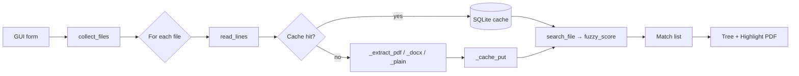

# Internals

Architecture and `_ar_norm` C extension reference.

---

## Architecture

`fuzzer` is a single Python script (`fuzzer` at the repo root, no `.py`
extension so it works as a binary on `$PATH`). GUI-only — a Tk app plus a C
extension for Arabic text normalization.

## File layout

```text
bin/
├── fuzzer                       ← the script (GUI app, single file)
├── transcribe                   ← helper: YouTube/audio/video → PDF
├── test_fuzzer.py               ← pytest suite
├── _ar_norm.cpython-*.so        ← built C extension
├── Makefile                     ← test, build-native, docs targets
├── native/
│   ├── ar_normalize.c           ← C source for _ar_norm
│   └── setup.py                 ← extension build script
└── docs/                        ← this directory
```

## Module sections in `fuzzer`

The script is internally divided by `# ── section ───` banners. Each section
is a small piece you can read top-to-bottom without juggling files.

| Section | Purpose |
| ------- | ------- |
| Color | ANSI helpers (`_c`, `_r`, `_err`) |
| Types | `Match` NamedTuple |
| Text extraction | `_extract_pdf`, `_extract_docx`, `_extract_plain`, `_EXT_MAP` |
| Extraction cache | SQLite-backed cache keyed by `(path, mtime)` |
| Arabic normalization | `_normalize_arabic` — C ext → pyarabic → regex fallback |
| Fuzzy matching | `_levenshtein`, `_builtin_ratio`, `fuzzy_score` (rapidfuzz/thefuzz) |
| Core search | `search_file` — the inner loop |
| Export | `export_results` + `_export_csv/json/xlsx/txt` |
| File collection | `collect_files` (recursion + glob) |
| GUI | `run_gui` — entire Tk app, nested functions for state encapsulation |

## Search flow



## GUI internals

The GUI runs the search on a background thread and posts updates through a
`queue.Queue`. The main thread polls the queue every 100 ms via
`root.after(100, poll_queue)`. This keeps the UI responsive during long
searches and avoids the GIL contention that would arise from direct widget
updates from the worker thread (Tk widgets are not thread-safe).

### Streaming results

The worker emits a `("match", fp, lines, matches)` message for **each file**
as soon as it finishes, rather than accumulating all results and sending a
single `("done", results)` at the end. This means:

- Matches appear in the tree as soon as each file is scanned — the GUI never
  looks frozen while a large file is being processed last.
- Results from completed files survive a crash on a later file.
- PDF highlight copies are built file-by-file (inside `_append_file_results`)
  so they are ready to open before the full search finishes.

A bare `("done",)` message (no payload) is sent once all files are exhausted
or after a Stop, using `state["results"]` (populated incrementally by
`"match"` messages) for the final summary.

### PDF extraction robustness

`_extract_pdf_pymupdf` wraps each page's `page.get_text()` call in a
try/except. If `sort=True` raises (e.g., on a malformed Arabic page with
complex glyph ordering), it retries with `sort=False`. If that also fails the
page is silently skipped. A single bad page therefore does not abort extraction
of the rest of the document.

### PDF highlighting (macOS)

When a PDF result row is opened:

1. `_build_highlighted_pdf` runs once per PDF during result population —
   it loads the PDF via PyMuPDF, groups matches by page, and tries three
   bbox-matching strategies in order:
   - Token-overlap: ≥60% normalized token coverage between match line and a dict line
   - Per-token fuzzy: any dict-line token at ≥70% similarity to the normalized query
   - Whole-line fuzzy: `SequenceMatcher` against the normalized full line, threshold 0.55
2. The highlighted copy is saved to `~/.fuzzer_tmp/fuzzer_<pid>_<id>.pdf`
3. Double-click invokes Preview via AppleScript:
   - `open POSIX file …`
   - resizes window via System Events UI scripting
   - jumps to the matched page using the `⌘⌥G` ("Go to Page…") shortcut

Tmp files older than 24 h are cleaned on every GUI launch.

## Launch behavior

- Window starts maximized on first launch and whenever the user closed it
  maximized last time (`_gui_state["window_state"] == "zoomed"`).
- Otherwise the window restores its saved geometry, auto-fits to its
  requested layout, then centers itself on the screen via
  `_center_window()`.

## Caching

Two caches exist:

| Cache | Where | Keyed by | Purpose |
| ----- | ----- | -------- | ------- |
| Extraction | `~/.fuzzer_cache.sqlite` | `path` + `mtime` | Skip re-parsing unchanged PDFs/DOCX |
| Highlighted PDFs | `~/.fuzzer_tmp/fuzzer_*.pdf` | Per-search, by `pid + id(doc)` | Pre-built copies for instant Preview-open |

## Optional dependencies

`fuzzer` degrades gracefully if optional libraries are missing. Each is tried
at the point of use and a clear error is emitted if absent.

| Library | What it enables | Fallback |
| ------- | --------------- | -------- |
| `_ar_norm` (this repo) | Fast Arabic normalization | `pyarabic` → pure-Python regex |
| `pymupdf` (`fitz`) | PDF extraction + highlighting | `pdfplumber` (no highlighting) |
| `python-docx` | DOCX extraction | error message |
| `rapidfuzz` | Fast fuzzy scoring | `thefuzz` → built-in Levenshtein |
| `openpyxl` | `.xlsx` export | error message |
| `tkinterdnd2` | Drag-and-drop into the GUI files entry | drag-drop disabled |
| `arabic_reshaper` + `python-bidi` | Arabic shaping fallback when CoreText is unavailable | text appears unshaped |

---

## _ar_norm C extension


A small CPython extension that performs the Arabic text normalization
`fuzzer` needs on every line of every searched file. It replaces a
`re.sub` + two `.translate()` calls with a single UTF-8 byte walk.

**Speedup:** ~11× faster than the pure-Python reference on a typical
Arabic line (0.054 ms → 0.005 ms per call, measured with `make bench-native`).

## Source

[native/ar_normalize.c](../native/ar_normalize.c) — ~120 lines of C99.

## What it does

| Operation | Codepoints | Rule |
| --------- | ---------- | ---- |
| Drop diacritics | U+064B – U+0652 | All eight harakat (fatha, kasra, damma, shadda, sukun, etc.) |
| Drop superscript alef | U+0670 | Drop |
| Drop tatweel | U+0640 | Drop |
| Normalize alef | U+0623 (أ), U+0625 (إ), U+0622 (آ), U+0671 (ٱ) | → U+0627 (ا) |
| Normalize yeh | U+0649 (ى), U+0626 (ئ) | → U+064A (ي) |

All other codepoints — including non-Arabic Unicode, English, digits, and
punctuation — pass through unchanged. The walk is UTF-8-safe for 1-, 2-, 3-,
and 4-byte sequences; only 2-byte sequences in the Arabic block trigger
decode + map logic, so non-Arabic text incurs ~zero overhead beyond a single
byte-class check per byte.

## Python API

```python
import _ar_norm

_ar_norm.normalize("السَّلَامُ عَلَيْكُمْ")
# → 'السلام عليكم'

_ar_norm.normalize("أهلا إلى آدم ٱلله")
# → 'اهلا الي ادم الله'

_ar_norm.normalize("Hello أحمد 123")
# → 'Hello احمد 123'
```

Signature: `normalize(s: str) -> str`.

Empty input returns empty output. Malformed UTF-8 is passed through
byte-for-byte (it is also handled by the final `PyUnicode_DecodeUTF8(...,
"replace")` decode, so non-decodable bytes become U+FFFD).

## Integration in fuzzer

`fuzzer` picks one of three implementations at module-load time, in this
priority:

```python
# fuzzer:224–249
try:
    import _ar_norm
    def _normalize_arabic(s): return _ar_norm.normalize(s)
except ImportError:
    try:
        from pyarabic.normalize import normalize_searchtext as _ar_norm_search
        def _normalize_arabic(s): return _ar_norm_search(s)
    except ImportError:
        # pure-Python regex + translate fallback
        ...
```

The C extension is loaded from the directory containing the `fuzzer` script
(added to `sys.path` at load time), so it works without an `install` step —
just `make build-native`.

## Building

```sh
make build-native    # idempotent; rebuilds only if .c is newer than .so
make clean-native    # remove the .so and the build/ tree
make bench-native    # compare C vs Python reference, print speedup
```

Manually:

```sh
cd native
python3 setup.py build_ext --inplace
cp _ar_norm*.so ..
```

Output binary name varies by Python version (e.g.
`_ar_norm.cpython-314-darwin.so` for Python 3.14 on arm64). The Makefile
uses a glob (`_ar_norm*.so`) so it doesn't care about the exact suffix.
The .so is **not** committed to git — built locally on first install.

## Testing

`make bench-native` and the existing pytest suite both exercise it. The
extension is used by every test that searches Arabic text because
`_normalize_arabic` is called from `_tokenize`, which the PDF highlighting
path uses on every dict line.

## Why not use ctypes / cffi?

Both add a per-call FFI overhead that would erase most of the speedup for
short strings. The CPython C API lets us return a Python `str` directly from
a `char *` buffer with one `PyUnicode_DecodeUTF8` call.

## Memory model

The output buffer is allocated once per call with `PyMem_Malloc(src_len + 1)`
— output is bounded by input length (drops shrink, maps preserve length, ASCII
copies one-for-one). It's freed before return. No reference cycles.
